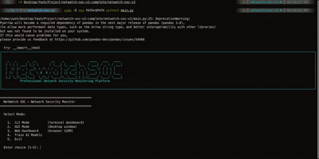
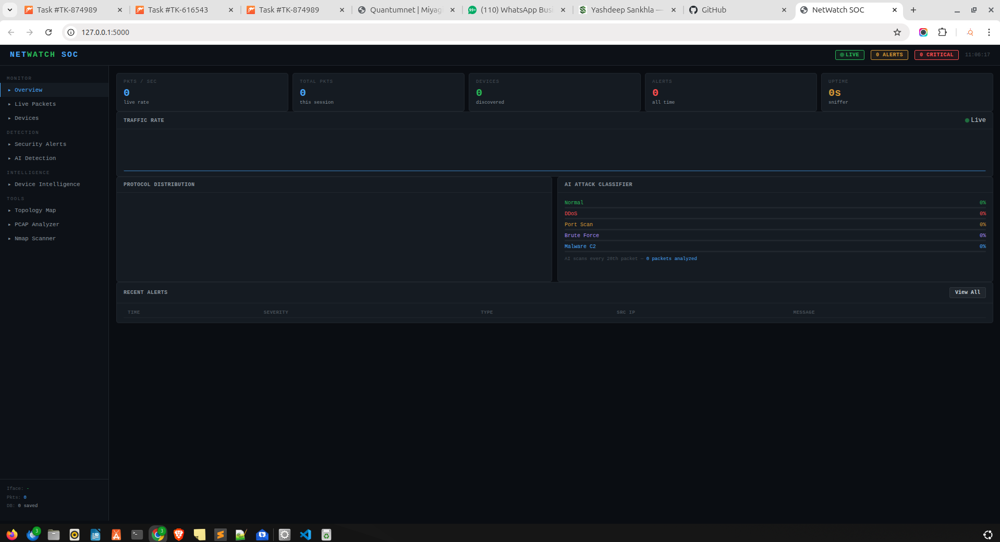
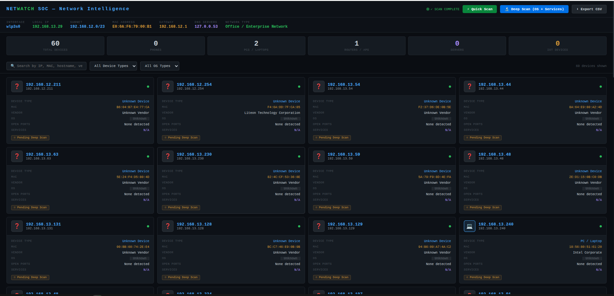
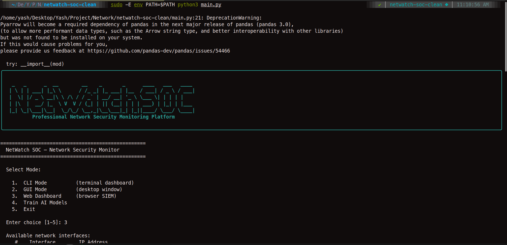
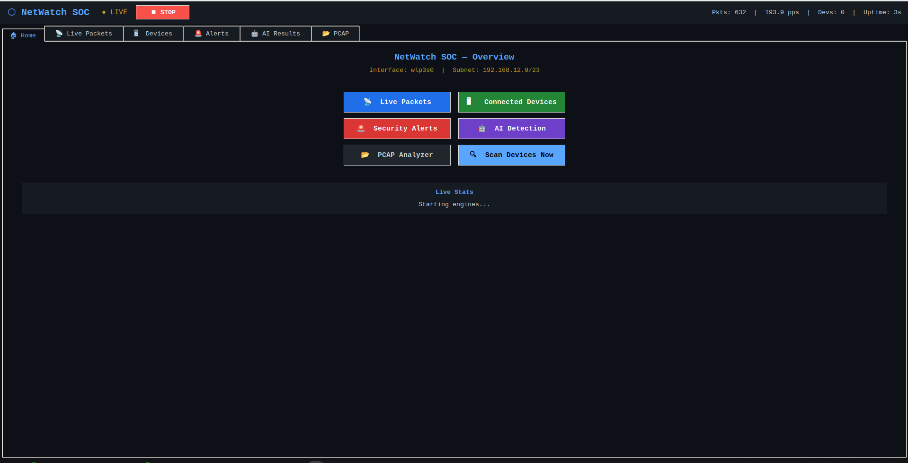

<div align="center">

# 🔐 NetWatch SOC

### Professional Network Security Monitoring Platform

[](https://python.org)
[](https://flask.palletsprojects.com)
[](https://scapy.net)
[](https://scikit-learn.org)
[](LICENSE)
[](https://github.com/YOUR_USERNAME/netwatch-soc)

**Real-time packet capture · AI threat detection · SIEM dashboard · Device intelligence**

[🚀 Quick Start](#-quick-start) · [📸 Screenshots](#-screenshots) · [🎯 Features](#-features) · [📖 Docs](#-documentation)

</div>

---

## 🎬 Demo



---

## 📸 Screenshots

| Overview Dashboard | Device Intelligence |
|---|---|
|  |  |

| CLI Mode | Desktop GUI |
|---|---|
|  |  |

---

## 🎯 Features

| Feature | Technology | Details |
|---|---|---|
| 📡 Live Packet Capture | Scapy | 500+ pps, Wireshark-style protocol dissection |
| 🔍 Device Discovery | ARP Scan | 83+ devices on /23 subnet in ~15 seconds |
| 🧠 Network Intelligence | ARP + Nmap + DNS | OS, vendor, hostname, active apps per device |
| 🚨 ARP Spoof Detection | IP→MAC trust table | CRITICAL alert on MAC mismatch |
| ⚡ Port Scan Detection | SYN sliding window | 20 unique ports in 5s = HIGH alert |
| 💥 DDoS Detection | Per-IP rate counter | 1500 pps threshold, no false positives |
| 🤖 AI Anomaly Detection | Isolation Forest | Detects zero-day threats (unsupervised) |
| 🎯 AI Attack Classifier | Random Forest | 94.3% accuracy — 5 attack classes |
| 🗺️ Topology Map | D3.js force graph | Live, draggable, auto-updates |
| 📊 SIEM Dashboard | Flask + Socket.IO | Real-time WebSocket streaming |
| 💻 3 Interfaces | Web + GUI + CLI | Browser, Tkinter, Rich terminal |
| 🗄️ Persistent Storage | SQLAlchemy + SQLite | Packets, alerts, devices saved |

---

## 📊 Project Stats

<div align="center">

| Metric | Value |
|---|---|
| Packets/Session | 21,675+ |
| Devices Discovered | 83 |
| AI Model Accuracy | 94.3% |
| Packets/Second | 500+ |
| Attack Types Detected | 10 |
| Interfaces | 3 |

</div>

---

## 🏗️ Architecture
```
Network Interface (wlan0/eth0)
         │
         ▼
  PacketSniffer (Scapy)
         │
         ├──► ProtocolAnalyzer ──► PacketRecord
         │
         ├──► ARPSpoofDetector  ──► AlertManager ──► DB + Browser
         ├──► PortScanDetector  ──► AlertManager ──► DB + Browser
         ├──► TrafficMonitor    ──► AlertManager ──► DB + Browser
         ├──► AnomalyDetector   ──► AlertManager ──► DB + Browser
         ├──► AttackClassifier  ──► AlertManager ──► DB + Browser
         ├──► TopologyMapper    ──► D3.js graph
         └──► socketio.emit()   ──► Browser (live)

NetworkScanner ──► 83+ devices ──► topology + DB
```

---

## 📁 Project Structure
```
netwatch-soc/
├── main.py                     # Entry point + startup menu
├── config.py                   # All settings
├── requirements.txt
│
├── core/
│   ├── packet_sniffer.py       # Scapy live capture
│   ├── protocol_analyzer.py    # Layer 2-7 dissector
│   ├── network_scanner.py      # ARP device discovery
│   └── network_intelligence.py # Full device profiling
│
├── detection/
│   ├── arp_spoof_detector.py
│   ├── port_scan_detector.py
│   └── traffic_monitor.py
│
├── ai_engine/
│   ├── feature_extractor.py
│   ├── model_trainer.py        # CIC-IDS-2017 pipeline
│   ├── anomaly_detector.py     # Isolation Forest
│   └── attack_classifier.py   # Random Forest
│
├── interface/
│   ├── cli.py                  # Rich terminal dashboard
│   ├── gui.py                  # Tkinter desktop GUI
│   └── web_dashboard.py       # Flask + Socket.IO
│
├── templates/
│   ├── dashboard.html          # Main SIEM dashboard
│   └── devices.html           # Device intelligence
│
├── utils/           # alert_manager, logger, network_utils
├── database/        # SQLAlchemy ORM
├── integrations/    # Nmap, PCAP handlers
├── visualization/   # Topology mapper
└── data/cicids2017/ # Place dataset CSVs here
```

---

## 🚀 Quick Start

### Prerequisites
```bash
# System packages
sudo apt install nmap python3-tk python3-pip git

# Python 3.8+
python3 --version
```

### Installation
```bash
# 1. Clone repository
git clone https://github.com/YOUR_USERNAME/netwatch-soc.git
cd netwatch-soc

# 2. Virtual environment
python3 -m venv venv
source venv/bin/activate

# 3. Install dependencies
pip install -r requirements.txt
sudo -E env PATH=$PATH pip3 install psutil requests
```

### Train AI Models
```bash
# Option A: Synthetic data (quick, demo only)
sudo -E env PATH=$PATH python3 main.py --train --synthetic

# Option B: Real CIC-IDS-2017 (recommended, better accuracy)
# Download: https://www.kaggle.com/datasets/cicdataset/cicids2017
# Place CSVs in: data/cicids2017/
sudo -E env PATH=$PATH python3 main.py --train
```

### Run
```bash
# Interactive menu
sudo -E env PATH=$PATH python3 main.py

# Direct modes
sudo -E env PATH=$PATH python3 main.py --mode web   # Browser SIEM
sudo -E env PATH=$PATH python3 main.py --mode cli   # Terminal
sudo -E env PATH=$PATH python3 main.py --mode gui   # Desktop
```

**Open browser:** `http://127.0.0.1:5001`  
**Device Intelligence:** `http://127.0.0.1:5001/devices-intel`

---

## 🧪 Test Attack Detection
```bash
# DDoS flood test
sudo ping -f 8.8.8.8
# → Dashboard: HIGH | DDOS_FLOOD alert

# Port scan test
sudo nmap -sS -p 1-100 192.168.12.1
# → Dashboard: HIGH | PORT_SCAN alert

# ARP spoof test
sudo apt install dsniff
sudo arpspoof -i wlan0 -t 192.168.12.1 192.168.12.2
# → Dashboard: CRITICAL | ARP_SPOOF alert
```

---

## 🤖 AI Model Details

| Model | Algorithm | Type | Result |
|---|---|---|---|
| Anomaly Detector | Isolation Forest | Unsupervised | Detects zero-day threats |
| Attack Classifier | Random Forest (100 trees) | Supervised | **94.3% accuracy** |

**5 Attack Classes:** Normal · DDoS · Port Scan · Brute Force · Malware C2

**Training Dataset:** CIC-IDS-2017 — University of New Brunswick  
*(2.8 million real network flow records)*

---

## ⚙️ Configuration
```python
# config.py
INTERFACE            = "wlan0"    # Auto-detected at startup
SUBNET               = "192.168.1.0/23"  # Auto-detected
ALERT_PPS_THRESHOLD  = 1500       # DDoS sensitivity
PORT_SCAN_THRESHOLD  = 20         # Ports before alert
PORT_SCAN_WINDOW_SEC = 5          # Detection window
WEB_PORT             = 5000       # Dashboard port
```

---

## 🔧 Troubleshooting

| Problem | Solution |
|---|---|
| `sudo: python3 not found` | Use `sudo -E env PATH=$PATH python3 main.py` |
| `No module named 'X'` | `sudo -E env PATH=$PATH pip3 install -r requirements.txt` |
| `0 packets captured` | Select `wlan0` interface, not `eth0` |
| `0 devices found` | Run with sudo, check subnet in config.py |
| `Port 5000 in use` | Auto-switches to 5001 |

---

## 📋 Requirements
```
OS:         Linux (Ubuntu 20.04+, Debian, Kali Linux)
Python:     3.8 or higher
Privileges: Root/sudo (required for raw packet capture)
RAM:        512 MB minimum, 2 GB recommended
Tools:      nmap, python3-tk
```

---

## 🗺️ Roadmap

- [ ] CIC-IDS-2017 real dataset training
- [ ] GeoIP attack source mapping
- [ ] Telegram / Email alert notifications
- [ ] CVE vulnerability database integration
- [ ] Docker deployment
- [ ] Distributed sensor support
- [ ] Custom YAML detection rules

---

## 📄 License

This project is licensed under the MIT License — see [LICENSE](LICENSE) for details.

---

## 👤 Author

**Yashdeep**  
Cybersecurity Engineer | SOC Analyst | Python Developer  
📍 Ahmedabad, Gujarat, India

[](https://linkedin.com/in/YOUR_PROFILE)
[](https://github.com/YOUR_USERNAME)
[](https://YOUR_PORTFOLIO.com)

---

<div align="center">

**If this project helped you, please ⭐ star the repository!**

*Built with ❤️ for the cybersecurity community*

</div>
